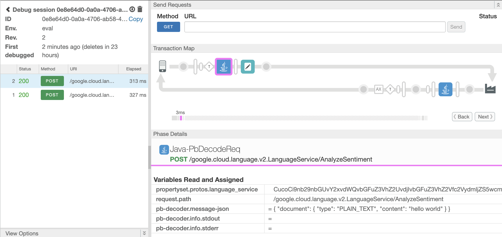
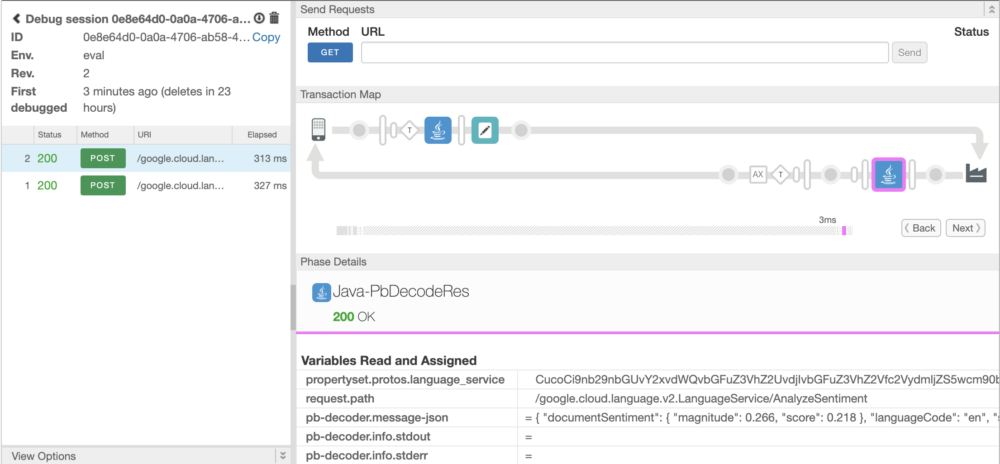

# Apigee X Protobuf Decoder Java Callout

This is a sample Apigee X API Proxy that shows how to decode binary gRPC payloads from request and response messages.

In Apigee X, there is no out-of-the-box policy that supports inspecting gRPC messages. This proxy uses an [Apigee Java Callout policy](https://cloud.google.com/apigee/docs/api-platform/reference/policies/java-callout-policy)
to decode the gRPC messages, and encode them as JSON. This is useful if you want to apply policies that need to perform
some action based on the gRPC payload. 


For this sample, the API Proxy is configured to invoke `language.googleapis.com` gRPC endpoint as the backend service.

## Caveat

As of October 2023, Apigee support for gRPC is in preview mode. Also, the [documentation](https://cloud.google.com/apigee/docs/api-platform/fundamentals/build-simple-api-proxy#creating-grpc-api-proxies) 
explicitly says that the gRPC payloads are opaque to Apigee. However, form a Java Callout policy it is possible to retrieve the
binary payload and process it, which is what is being done in this example. Treat this example code as a proof-of-concept/experiment only.

## How it works

The API Proxy uses a generic Java Callout policy that takes both the gRPC message, and the protobuf descriptor as input.
The output of the Java callout policy is a new flow variable named `pb-decoder.message-json`.

Below is an example XML snippet for how to execute the Java Callout policy:

```xml
<?xml version="1.0" encoding="UTF-8" standalone="yes"?>
<JavaCallout continueOnError="false" enabled="true" name="Java-PbDecodeReq">
  <DisplayName>Java-PbDecodeReq</DisplayName>
  <Properties>
    <Property name="pb-descriptor-base64-ref">propertyset.protos.language_service</Property>
    <Property name="pb-service-method-ref">request.path</Property>
    <Property name="pb-message-ref">request</Property>
  </Properties>
  <ClassName>com.google.apigee.callouts.ProtobufDecoder</ClassName>
  <ResourceURL>java://apigee-callout-protobuf-decoder.jar</ResourceURL>
</JavaCallout>
```

The following properties can be set as inputs for the Java Callout. 

* **pb-descriptor-base64-ref** - This is the name of a flow variable that contains the protobuf descriptor  (base64 encoded).
  In the example above, the protobuf descriptor is stored inside a property set flow variable. Take a look at [build-proto.sh](./build-proto.sh) to see how this is created.


* **pb-service-method-ref** - This is the name of a flow variable that contains the gRPC service name and method name being invoked. (e.g. `my.package.ServiceName/MethodName`). 
  In the example above, this is set to `request.path` since gRPC requests over HTTP will contain both the service name, and method name within the HTTP request path.


* **pb-message-ref** - This is the name of the flow variable that contains the gRPC message. (only `request` or `response` is supported).
  This also determines which protobuf message type is used for decoding the gRPC binary payload. 
  If you choose `request`, it uses the request message type of the gRPC service method being invoked.
  If you choose `response`, it uses the response message type of the gRPC service method being invoked.

## Pre-Requisites

- Java (9 or later), gcloud, tar, zip

## Deploying sample API Proxy

Both the Java Callout (for decoding gRPC binary payloads), and the [proto file](https://github.com/googleapis/googleapis/blob/master/google/cloud/language/v2/language_service.proto) for `languague.googleapis.com` have already been pre-built and included as part of the sample API Proxy.

See

* [apiproxy/resources/java/apigee-callout-protobuf-decoder.jar](apiproxy/resources/java/apigee-callout-protobuf-decoder.jar)
* [apiproxy/resources/properties/protos.properties](apiproxy/resources/properties/protos.properties)

If you only want to deploy this sample API Proxy, without manually re-compiling the java code or the proto file, follow the steps below:

* Download the `apigeecli` tool 
  ```shell
  ./download-apigeecli.sh
  ```

* Deploy the sample Apigee API Proxy ([apiproxy](/apiproxy))
  ```shell
  export APIGEE_ORG="your-apigee-org-name"
  export APIGEE_ENV="your-apigee-env-name"
  
  ./deploy-apigee-apiproxy.sh
  ```
  
## Testing the sample API Proxy

* Download the `grpcurl` client tool
  ```shell
  ./download-grpcurl.sh
  ```

* Download the googleapis proto files  (if not already)
  ```shell
  ./download-googleapis-protos.sh
  ```

* Go to [Google OAuth2 Playground](https://developers.google.com/oauthplayground), and get an OAuth 2 token for the `Cloud Natural Language API V2` API. The scopes needed are:
  * `https://www.googleapis.com/auth/cloud-language`
  * `https://www.googleapis.com/auth/cloud-platform`


  

* Use the `grpcurl` tool to invoke the API Proxy
```shell
export TOKEN="ya29.a0AfB_byD9YhJAKEIB3f9Xm7..."
export APIGEE_HOST="34.98.92.32.nip.io"

./tools/grpcurl/bin/grpcurl -H "Authorization: Bearer $TOKEN"  \
        -import-path ./tools/googleapis \
        -proto ./tools/googleapis/google/cloud/language/v2/language_service.proto \
-d '{
  "document": {
    "type": "PLAIN_TEXT",
    "content": "hello world"
  }
}' "${APIGEE_HOST}:443"  google.cloud.language.v2.LanguageService.AnalyzeSentiment
```


* You can start a debug session on the Apigee console, and verify that the Java callout is producing the expected
  JSON payload in the `pb-decoder.message-json` flow variable. See examples below:

  * Request body as JSON
  

  * Response body as JSON
  


## Building the proto descriptor file

This step is only needed if you want to rebuild the proto descriptor file at [apiproxy/resources/properties/protos.properties](apiproxy/resources/properties/protos.properties)


* Download the `protoc` compiler tool. 
  ```shell
  ./download-protoc.sh
  ```

* Download the `googleapis` proto files.
  ```shell
  ./download-googleapis-protos.sh
  ```

* Build the proto descriptor file

  ```shell
  ./build-proto.sh
  ```


## Building the Java Callout Jar file

This step is only needed if you want to re-build the included Jar file at [apiproxy/resources/java/apigee-callout-protobuf-decoder.jar](apiproxy/resources/java/apigee-callout-protobuf-decoder.jar)
Download all the tools from the Setup section, then run the following script.


* Download the `mvn` tool (unless you have maven already installed)
  ```shell
  ./download-maven.sh
  ```

* Build the Java Callout Jar file
  ```shell
  ./build-jar.sh
  ```


## License

This code is released under the Apache Source License v2.0. For information see the [LICENSE](LICENSE) file.

## Disclaimer

This example is not an official Google product, nor is it part of an official Google product.

